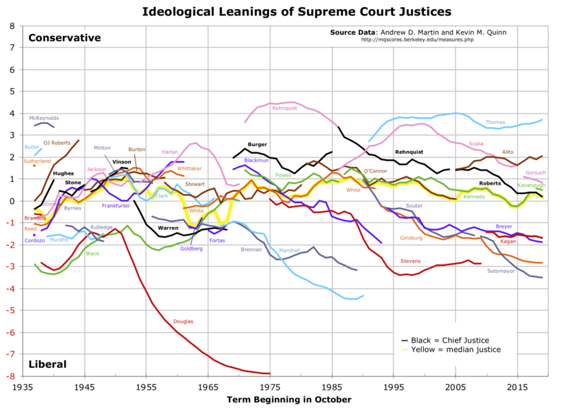
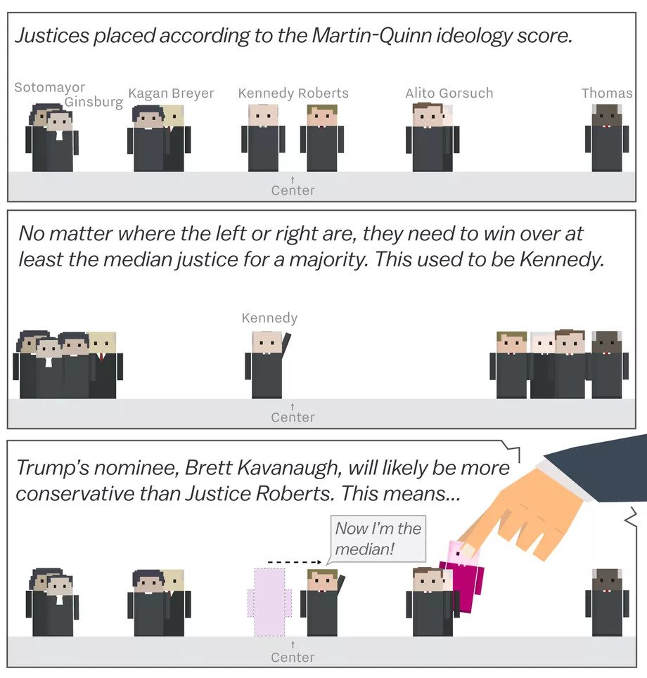
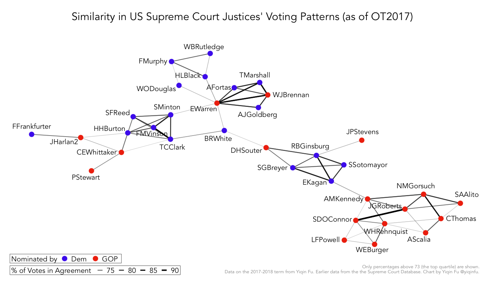

# US\_Supreme\_Court\_Justices

A repository to analyse the [ideological leanings](https://en.wikipedia.org/wiki/Ideological_leanings_of_United_States_Supreme_Court_justices) of US\_Supreme\_Court\_Justices.

The [ideological leaning of the median](https://en.wikipedia.org/wiki/Median_voter_theorem) justice is considered a(n almost perfect) measure of where the whole court. The median voter theorem works perfectly if all alternatives are placed one-dimensionally. See [Martin-Quinn score](https://en.wikipedia.org/wiki/Martin-Quinn_score) and the following images:

But is it really *that* one-dimensional? See for example: [Network of All Historical U.S. Supreme Court Justices by Voting Coincidence](https://yiqinfu.github.io/posts/supreme-court-kennedy-retirement-ot2017/)

Let's have a look :)

Other sources:

- [https://www.vox.com/2018/7/2/17518822/supreme-court-kennedy-median-justice-volatile-cartoon](https://www.vox.com/2018/7/2/17518822/supreme-court-kennedy-median-justice-volatile-cartoon)  
- [https://fivethirtyeight.com/features/supreme-court-justices-get-more-liberal-as-they-get-older/](https://fivethirtyeight.com/features/supreme-court-justices-get-more-liberal-as-they-get-older/)  
- [http://supremecourtdatabase.org/](http://supremecourtdatabase.org/)  
- [https://fivethirtyeight.com/features/the-supreme-court-might-have-three-swing-justices-now/](https://fivethirtyeight.com/features/the-supreme-court-might-have-three-swing-justices-now/)